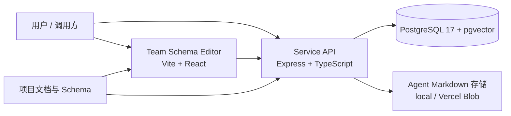

# Agents Team

[English README](README.md)


一个基于 pnpm monorepo 的多智能体协作平台工程，包含：

- 后端服务（`@agents-team/service`）：负责任务运行时编排、团队 Schema 校验、Agent Markdown 管理
- 可视化编辑器（`@agents-team/team-schema-editor`）：用于编辑团队 Schema
- 完整文档体系：PRD、需求、实现方案与 API 文档

## 核心特性

- 基于 `pnpm-workspace` 的多包仓库管理
- 前后端统一 TypeScript 技术栈
- PostgreSQL + pgvector 持久化支持
- 后端按文件自动注册路由（`packages/service/src/routes`）
- 统一响应结构（成功：`ok/data`，失败：`ok/error`）

## 技术栈

- Node.js 22+
- pnpm 10+
- 后端：Express 5、Prisma、Zod
- 前端：React 19、Vite、MUI
- 数据库：PostgreSQL 17 + pgvector

## 架构概览



## 目录结构

```text
.
├── docker-compose.dev.yml
├── docker/
├── docs/
├── packages/
│   ├── agents/
│   ├── service/
│   └── team-schema-editor/
└── package.json
```

## 环境准备

- Node.js `>= 22`
- pnpm `>= 10`
- Docker + Docker Compose（推荐本地开发使用）

## 快速开始

### 方式 A：Docker（推荐）

```bash
pnpm dev:docker
```

启动后默认地址：

- 服务端： http://127.0.0.1:3000
- 编辑器： http://127.0.0.1:5173
- PostgreSQL： `localhost:5432`

Docker 初始化会自动写入默认示例工作区（`current`、`software-delivery-team`、`mvp-rag-memory-toolcall-team`，以及 sequential / parallel 讨论模式变体），并在编辑器首次加载时提供 LLM / Skills / MCP / Tools 的完整示例目录，方便直接调试。

### 方式 B：本地运行

1. 安装依赖

```bash
pnpm install
```

2. 启动 PostgreSQL（本地或容器均可）

3. 配置环境变量（见下文）

4. 初始化数据库

```bash
pnpm --filter @agents-team/service db:bootstrap
```

5. 启动服务与编辑器

```bash
pnpm dev
```

分别启动：

```bash
pnpm dev:service
pnpm dev:editor
```

## 环境变量

服务端：

- `DATABASE_URL`（必填）
- `PORT`（可选，默认 `3000`）
- `NODE_ENV`（可选）
- `AGENT_MARKDOWN_STORAGE`（可选：`local` 或 `vercel_blob`）
- `AGENT_MARKDOWN_BLOB_PREFIX`（可选）

编辑器：

- `VITE_EDITOR_EXPOSE_HOST`（可选，Docker 开发场景使用）

## 常用命令

仓库根目录：

```bash
pnpm install
pnpm build
pnpm typecheck
pnpm dev
pnpm dev:docker
```

服务包：

```bash
pnpm --filter @agents-team/service dev
pnpm --filter @agents-team/service build
pnpm --filter @agents-team/service typecheck
pnpm --filter @agents-team/service db:bootstrap
pnpm --filter @agents-team/service prisma:migrate:dev
```

## API 快速验证

健康检查：

```bash
curl -s http://127.0.0.1:3000/health | jq
```

校验团队 Schema：

```bash
curl -s -X POST http://127.0.0.1:3000/team/validate \
  -H 'Content-Type: application/json' \
  --data @docs/examples/software-delivery-team.json | jq
```

完整 API 文档：

- `docs/service-api.md`

## 文档索引

- PRD：`docs/PRDs`
- 需求：`docs/requirements`
- 实现：`docs/implementation`
- Team Schema：`docs/schemas/team.schema.json`

## 生产环境建议

- 设置 `NODE_ENV=production`
- 使用托管 PostgreSQL 并妥善管理凭据
- 推荐 `AGENT_MARKDOWN_STORAGE=vercel_blob`
- 通过反向代理/API 网关暴露服务，并接入日志与监控

### 云主机最小部署示例

仅部署后端服务与 PostgreSQL 的简化流程：

```bash
docker compose up -d postgres
pnpm install --frozen-lockfile
pnpm --filter @agents-team/service db:bootstrap
pnpm --filter @agents-team/service build
pnpm --filter @agents-team/service start
```

推荐生产环境变量：

```bash
NODE_ENV=production
PORT=3000
DATABASE_URL=postgresql://<user>:<password>@<host>:5432/<db>
AGENT_MARKDOWN_STORAGE=vercel_blob
AGENT_MARKDOWN_BLOB_PREFIX=agents-team
```

如需完整容器化生产部署，建议单独维护 `docker-compose.prod.yml`，并至少包含：

- 固定版本的镜像/构建产物
- 非 root 用户运行
- 日志与备份的持久化策略
- 安全的密钥注入方式（避免明文写在 compose 文件）

## 典型开发流程

1. 拉取代码并安装依赖。

```bash
git pull
pnpm install
```

2. 启动依赖与应用。

```bash
pnpm dev:docker
```

3. 修改 Schema、路由或运行时逻辑。

- Team Schema：`docs/schemas/team.schema.json`
- 服务路由：`packages/service/src/routes`
- Runtime 逻辑：`packages/service/src/runtime`

4. 快速验证接口行为。

```bash
curl -s http://127.0.0.1:3000/health | jq
curl -s -X POST http://127.0.0.1:3000/team/validate \
  -H 'Content-Type: application/json' \
  --data @docs/examples/software-delivery-team.json | jq
```

5. 提交前执行质量检查。

```bash
pnpm typecheck
pnpm build
```

6. 提交并发起 PR。

```bash
git add .
git commit -m "feat: <简要描述>"
```

## CI 状态

仓库当前在 `.github/workflows` 下没有检测到 GitHub Actions 工作流。
后续接入 CI 后，可在本节添加 build/typecheck/test 徽章。

## 贡献指南

1. 新建功能分支
2. 保持修改范围清晰、类型安全
3. 提交前执行 typecheck 与必要构建
4. 变更 API 或行为时同步更新文档

## 许可

仓库当前未包含 `LICENSE` 文件。如需开源，请补充明确的许可证文件。
