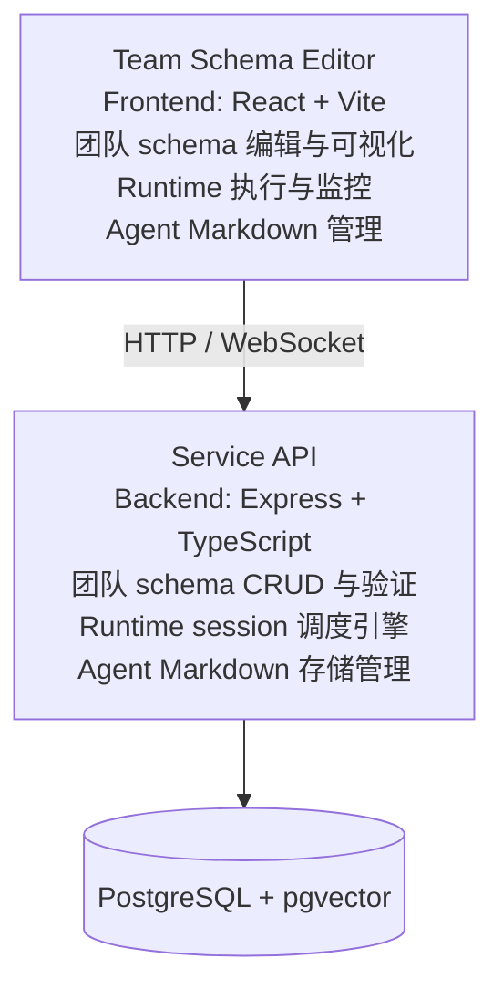
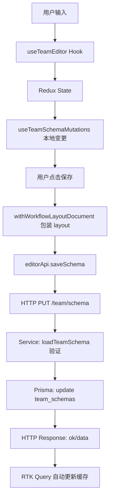
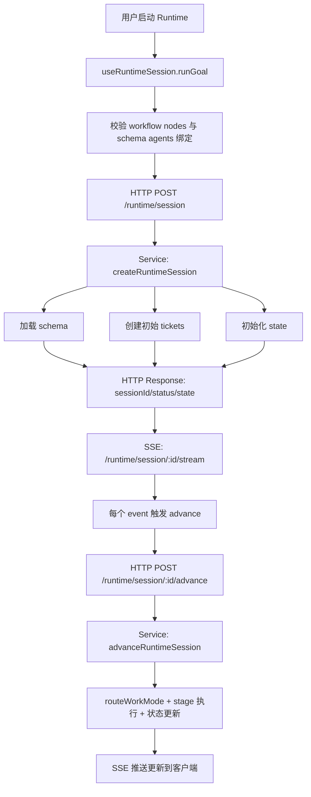
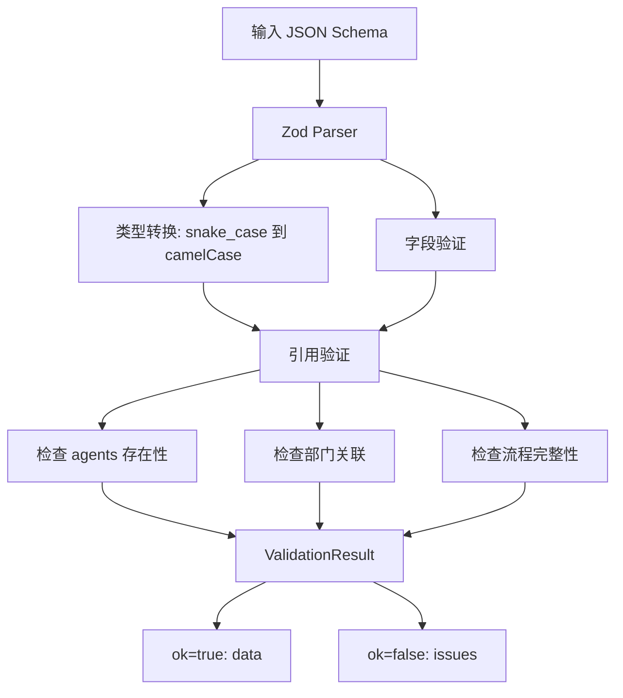
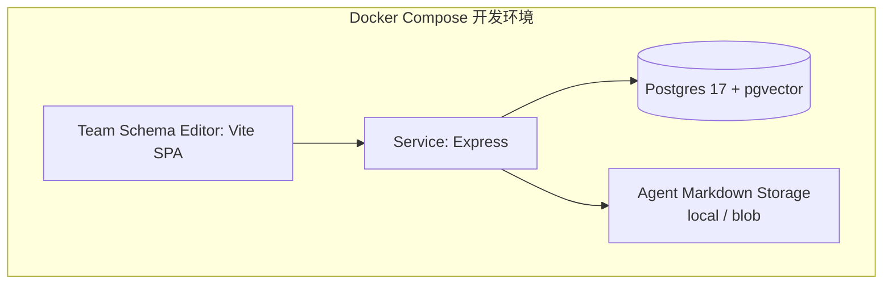

# 项目架构概览

## 系统组成

**agents-team** 是一个多代理协作平台，包含两个核心项目：



## 核心概念

### 1. Team Schema（团队定义）

团队schema定义了多代理协作的完整结构：

```typescript
interface TeamDefinition {
  name: string;
  description?: string;
  agents: AgentDefinition[];           // 代理定义
  departments: DepartmentDefinition[];  // 部门分组
  discussions: DiscussionDefinition[];  // 讨论流程
  pipelines: PipelineDefinition[];      // 任务管道
  deliverables: DeliverableDefinition[]; // 交付物
  layout?: WorkflowLayout;              // 可视化布局
}
```

### 2. Runtime Session（运行时会话）

管理单次执行的完整生命周期：

- **初始化**: 加载schema, 创建初始ticket
- **执行**: 根据work mode推进状态机
- **监控**: 记录所有事件、结果、处理决策
- **完成**: 收集handoffs和评审结果

### 3. Work Mode（工作模式）

会话执行中的三种主要流程：

| Mode | 用途 | 处理者 |
|------|------|--------|
| **Discussion** | 多agent讨论 | 所有关联agents |
| **Pipeline** | 顺序任务执行 | ticket持有者 |
| **Delivery** | 交付物评审 | reviewer agents |

## 系统分层

### Backend (Service)

```
src/
├── domain/              # 纯类型定义 (无代码依赖)
│   ├── organization.ts  # Team, Agent, Department
│   ├── discussion.ts    # Discussion, Ticket
│   ├── delivery.ts      # Deliverable, Review
│   ├── runtime.ts       # RuntimeSession, RuntimeState
│   └── ...
├── schema/              # Schema加载与验证
│   ├── loadTeamSchema.ts
│   ├── teamDefinitionSchema.ts (Zod验证规则)
│   └── teamReferenceValidation.ts
├── routes/              # HTTP API路由 (自动注册)
│   ├── team/schemas/
│   ├── runtime/session/
│   ├── agent-markdown/
│   └── ...
├── runtime/             # 运行时引擎
│   ├── advanceRuntimeSession.ts (状态机)
│   ├── routeWorkMode.ts
│   └── advanceRuntimeSession/
│       ├── discussion.ts
│       ├── pipeline.ts
│       └── delivery.ts
├── agent/               # Agent相关
│   ├── assembly/        # Agent组装
│   └── markdown/        # Markdown CRUD
└── adapter/             # 外部依赖适配
    ├── agentMarkdownAdapter.ts
    ├── prismaClient.ts
    └── runtimeObservabilityRepository.ts
```

### Frontend (Team Schema Editor)

```
src/
├── app/                 # 应用入口
│   ├── App.tsx
│   ├── pages/          # 页面组件
│   ├── theme.ts
│   └── notification/
├── editor/              # 编辑器核心
│   ├── hooks/          # 业务逻辑hooks
│   │   ├── useTeamEditor.ts      (编辑器聚合)
│   │   ├── useTeamSchemaService.ts (schema服务)
│   │   ├── useRuntimeSession.ts   (runtime服务)
│   │   └── useWorkflowGraphEditor.ts (图编辑)
│   ├── components/     # UI组件
│   │   ├── EditorHero.tsx
│   │   ├── GraphPanel.tsx
│   │   ├── RuntimePanel.tsx
│   │   └── SelectionPanel.tsx
│   ├── api/            # API客户端 (RTK Query)
│   │   ├── editorApi.ts
│   │   ├── teamSchemaApi.ts
│   │   ├── runtimeSessionApi.ts
│   │   └── agentMarkdownApi.ts
│   ├── customNodes/    # React Flow节点
│   ├── customEdges/    # React Flow边
│   ├── model/          # 数据模型
│   └── state/          # Redux store
└── ...
```

## 数据流

### 编辑流程



### 运行流程



## 核心交互方式

### 1. HTTP REST API (自动路由注册)

- **路由约定**: `src/routes/<path>/<METHOD>.ts` → `<METHOD> /<path>`
- **参数映射**: `[param]` → `:param`
- **响应格式**: 
  ```typescript
  { ok: true, data: T } | { ok: false, error: { code, message, issues? } }
  ```

### 2. Redux + RTK Query (前端状态)

- **持久状态**: schema, selection, validationIssues
- **API缓存**: editorApi基于RTK Query
- **同步机制**: 通过redux thunks和hooks

### 3. React Flow (可视化图编辑)

- **节点类型**: Agent, Department, Pipeline, Discussion, Memory
- **边类型**: WithAgents(讨论), WithDepartments(管道), WithDepartmentsAndDiscuss(广播)
- **布局持久化**: 保存在schema.layout中

## 验证流程



## 环境配置

### Backend (.env)

```bash
DATABASE_URL=postgresql://...
AGENT_MARKDOWN_STORAGE=local  # or vercel_blob
PORT=3000
```

### Frontend (Vite环境变量)

```bash
VITE_SERVICE_ORIGIN=http://localhost:3000
```

## 部署拓扑



## 关键依赖版本

- Node.js: ≥22
- Express: 5.x
- React: 19.x
- TypeScript: 5.x
- PostgreSQL: 17 + pgvector
- Prisma: 7.x
- @xyflow/react: 12.x
- Redux Toolkit: 2.x
- MUI: 9.x

## 下一步阅读

1. [Service 架构详解](./01-service-architecture.md)
2. [前端编辑器架构](./02-team-schema-editor-architecture.md)
3. [数据流与集成](./03-data-flow-and-integration.md)
4. [Runtime 引擎](./04-runtime-engine.md)
5. [API 合同](./05-api-contracts.md)
