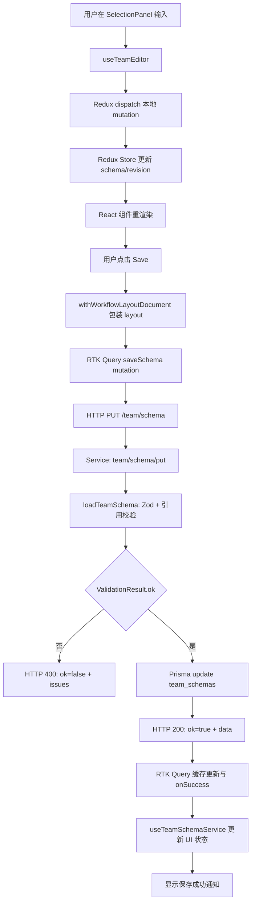
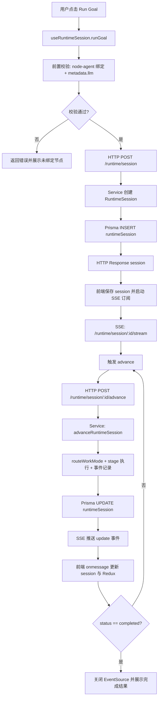
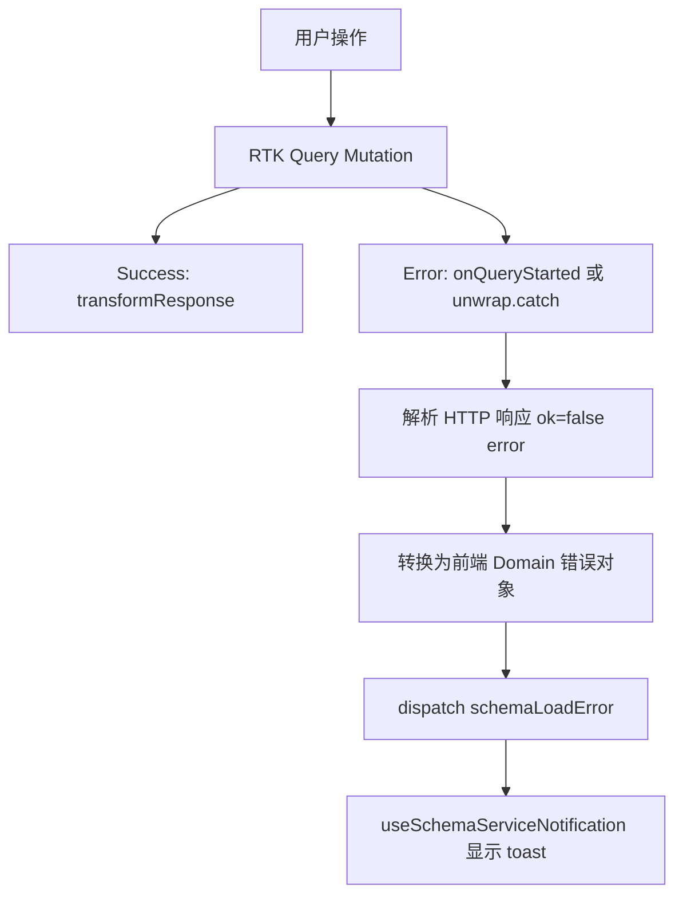

# 数据流与集成

## 端到端数据流

### 1. 编辑流程 (Schema编辑→保存)



### 2. Runtime执行流程



## 关键集成点

### 1. Frontend ↔ Backend API 代理

#### 开发环境 (Vite)

```typescript
// vite.config.ts
export default defineConfig({
  server: {
    proxy: {
      '/team': 'http://localhost:3000',
      '/runtime': 'http://localhost:3000',
      '/agent-markdown': 'http://localhost:3000',
      '/agent-gateway': 'http://localhost:3000'
    }
  }
});
```

#### 生产环境

```typescript
// env配置
VITE_SERVICE_ORIGIN=https://api.example.com
```

RTK Query自动使用该baseUrl。

### 2. Redux ↔ RTK Query集成

```typescript
// editorStore配置
const store = configureStore({
  reducer: {
    editor: editorReducer,           // 同步状态 (编辑)
    editorApi: editorApi.reducer     // 异步缓存 (API)
  },
  middleware: (getDefaultMiddleware) =>
    getDefaultMiddleware()
      .concat(editorApi.middleware)  // RTK Query middleware
});

// 两层状态的交互模式
// 1. 本地编辑: editor reducer (即时, 无网络)
// 2. 服务端fetch: editorApi reducer (缓存) 
// 3. 保存: mutation发送编辑后的editor state → server
// 4. 刷新: 从editorApi cache读取最新server data → editor state
```

### 3. React Flow ↔ Redux同步

```typescript
// 单向流: Redux → React Flow
// - useSelector(selectSchema) → 初始化nodes
// - 每次schema变更 → 重新生成nodes

// 单向流: React Flow → Redux  
// - onNodesChange 回调 → dispatch(updateWorkflowNodes)
// - onEdgesChange 回调 → dispatch(updateWorkflowEdges)

// 双向问题:
// ❌ 不要在React Flow change中同时改Redux和local state
// ✓ 只改Redux, 让React Flow从Redux重新render
```

### 4. Frontend ↔ SSE流集成

```typescript
// 客户端: EventSource连接
const eventSource = new EventSource(`/runtime/session/${id}/stream`);

eventSource.onmessage = (event) => {
  // event.data = JSON string
  const update = JSON.parse(event.data);
  
  // 更新React state
  setSessions(new Map(sessions).set(id, update.session));
  
  // 更新Redux
  dispatch(updateRuntimeState(update));
  
  // 更新UI
  if (update.session.status === 'completed') {
    eventSource.close();
  }
};

// 服务端: 持续推流
res.setHeader('Content-Type', 'text/event-stream');
res.setHeader('Cache-Control', 'no-cache');
res.setHeader('Connection', 'keep-alive');

const interval = setInterval(() => {
  const session = loadSessionFromDb(sessionId);
  res.write(`data: ${JSON.stringify({ session })}\n\n`);
  
  if (session.status !== 'running') {
    clearInterval(interval);
    res.end();
  }
}, 1000);  // 每秒推一次
```

## 错误处理链

### Frontend 错误捕获



### 验证错误示例

```typescript
// 场景: 用户上传invalid schema

// Service返回
{
  ok: false,
  error: {
    code: 'VALIDATION_ERROR',
    message: 'Schema validation failed',
    issues: [
      {
        path: ['agents', 'agent-1', 'department_id'],
        code: 'REFERENCE_ERROR',
        message: 'Department agent "invalid-dept" not found',
        context: 'Department agents must exist in the team'
      }
    ]
  }
}

// Frontend RTK Query自动转换
// → useValidateSchemaMutation() 返回
const [validate] = useValidateSchemaMutation();
try {
  await validate({ schema }).unwrap();
} catch (error) {
  // error.error.issues[0].path = ['agents', 'agent-1', 'department_id']
  dispatch(updateValidationIssues(error.error.issues));
  notification.error('Schema validation failed');
}

// SelectionPanel 显示错误
// - AgentSelectionView 字段旁显示红色错误指示
// - 用户修复agent关联的department
// - 重新验证
```

## 并发与竞态条件处理

### 1. 编辑冲突 (编辑中被其他用户修改)

```typescript
// RTK Query tag invalidation
const [saveSchema] = editorApi.useSaveSchemaMutation({
  onQueryStarted(arg, { dispatch, queryFulfilled }) {
    queryFulfilled
      .then(() => {
        // 清除所有schema相关缓存
        dispatch(editorApi.util.invalidateTags(['Schema']));
        
        // 重新fetch新的schema
        dispatch(editorApi.util.refetchQueries(['getSchemas']));
      })
      .catch((error) => {
        if (error.status === 409) {  // Conflict
          // 引导用户reload
          notification.error('Schema was modified by another user');
          editor.reloadSchema();
        }
      });
  }
});
```

### 2. React StrictMode下的cleanup

```typescript
// 问题: StrictMode双重render导致cleanup丢弃请求结果
// 症状: Redux state 停在 'loading'

// 解决: 添加mounted flag
const [saveSchema] = editorApi.useSaveSchemaMutation();

const saveSchemaImpl = useCallback(async (schema) => {
  let mounted = true;
  
  try {
    const result = await saveSchema({ schema }).unwrap();
    if (mounted) {
      dispatch(schemaLoadSuccess(result));
    }
  } catch (error) {
    if (mounted) {
      dispatch(schemaLoadError(error.message));
    }
  }
  
  return () => { mounted = false; };
}, [saveSchema, dispatch]);
```

### 3. Runtime session并发advance

```typescript
// 问题: 用户连续点击"Advance"按钮导致并发requests
// 症状: 状态不一致

// 解决: 加button disable + request cancellation
const [advanceSession, advanceSessionState] = 
  editorApi.useAdvanceRuntimeSessionMutation();

const onAdvanceClick = async () => {
  if (advanceSessionState.isLoading) return;  // 禁止重复提交
  
  try {
    const result = await advanceSession({ sessionId }).unwrap();
    setSessions(new Map(sessions).set(sessionId, result));
  } catch (error) {
    if (error.code === 'NOT_RUNNING') {
      // 另一个客户端已完成, reload
      const current = await loadSession(sessionId);
      setSessions(new Map(sessions).set(sessionId, current));
    }
  }
};

<Button
  onClick={onAdvanceClick}
  disabled={advanceSessionState.isLoading}
>
  {advanceSessionState.isLoading ? 'Advancing...' : 'Advance'}
</Button>
```

## 性能监控点

### Frontend

- React render时间 (React DevTools Profiler)
- React Flow 节点渲染性能 (>1000个节点时考虑虚拟化)
- Redux state size (redux-persist可优化large schemas)
- RTK Query缓存命中率

### Backend

- 路由自动注册时间 (startTime)
- loadTeamSchema 验证时间 (benchmark Zod vs自写)
- Prisma query时间 (启用slowQueryLog)
- SSE推流延迟 (event timestamp vs client receive)

### 网络

- Schema PUT 请求大小 (考虑压缩)
- SSE连接稳定性 (reconnection策略)
- TypeScript编译时间 (monorepo跨包依赖)

## 下一步阅读

- [Runtime 引擎详解](./04-runtime-engine.md)
- [API 合同](./05-api-contracts.md)
- [状态管理详解](./06-state-management.md)
