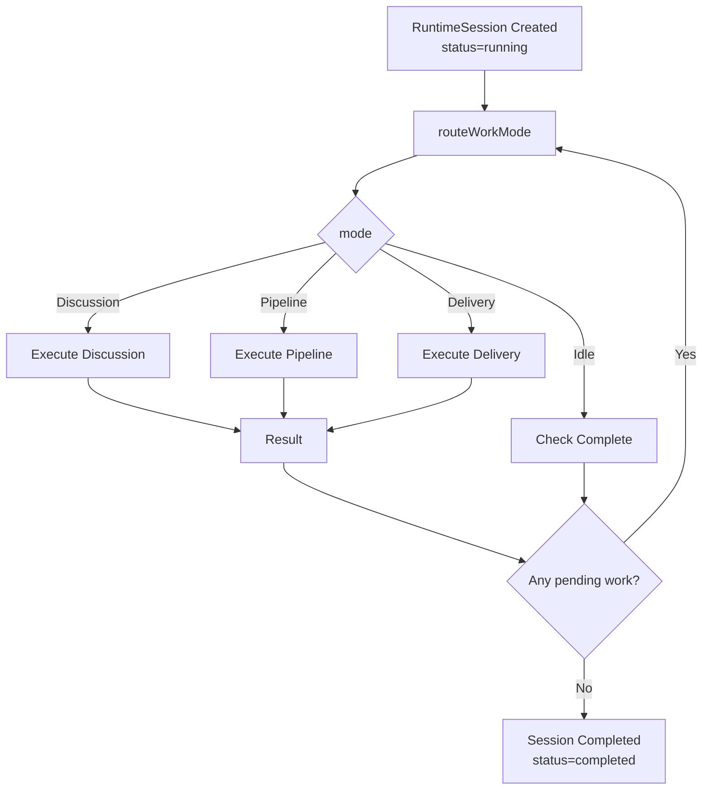
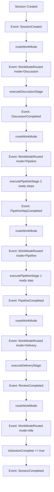

# Runtime Engine - 运行时引擎详解

## 概述

Runtime Engine是agents-team的核心执行引擎，负责：
- **Session管理**: 创建、追踪、推进会话生命周期
- **工作模式路由**: 根据状态机决策下一步执行模式
- **并发执行**: Discussion和Pipeline的阶段执行
- **事件记录**: 完整的审计日志与观测性
- **状态持久化**: 会话快照和中间结果

## 核心数据模型

### RuntimeSession

```typescript
interface RuntimeSession {
  id: string;                    // 唯一标识
  status: 'running' | 'completed' | 'failed';
  state: RuntimeState;           // 当前执行状态
  events: RuntimeEvent[];        // 事件日志 (审计)
  createdAt: Date;
  updatedAt: Date;
}

interface RuntimeState {
  workModeDecision?: WorkModeDecision;  // 最后决策的work mode
  pendingTickets: Ticket[];             // 待处理tickets
  completedTickets: Ticket[];           // 已完成tickets
  activePipeline?: PipelineInstance;    // 当前active的pipeline
  discussionResult?: DiscussionResult;  // 最后的discussion结果
  completedStepResults: StepResult[];   // 已完成步骤的结果
  generatedHandoffs: Handoff[];         // 交接信息
  reviewResults: ReviewResult[];        // 评审结果
  context?: ExecutionContext;           // 执行上下文
  interruption?: Interruption;          // 中断信息
}

interface Ticket {
  id: string;
  status: 'pending' | 'in_progress' | 'completed';
  holder?: string;    // 当前持票人agent
  deliverable_id?: string;
  pipeline_id?: string;
  metadata?: Record<string, unknown>;
}

interface PipelineInstance {
  id: string;
  steps: PipelineStep[];
  currentStepIndex: number;
  status: 'ready' | 'in_progress' | 'completed' | 'failed';
}

interface PipelineStep {
  id: string;
  agent_id: string;
  status: 'ready' | 'in_progress' | 'completed' | 'failed';
  dependsOn?: string[];   // 前置step的IDs
}

interface RuntimeEvent {
  id: string;
  sessionId: string;
  eventType: string;
  timestamp: Date;
  reason?: string;
  metadata?: Record<string, unknown>;
}

export enum RUNTIME_EVENT_TYPE {
  SessionCreated = 'runtime.session.created',
  WorkModeRouted = 'runtime.work_mode.routed',
  DiscussionStarted = 'runtime.discussion.started',
  DiscussionCompleted = 'runtime.discussion.completed',
  PipelineStarted = 'runtime.pipeline.started',
  PipelineStepCompleted = 'runtime.pipeline.step.completed',
  PipelineCompleted = 'runtime.pipeline.completed',
  ReviewStarted = 'runtime.review.started',
  ReviewCompleted = 'runtime.review.completed',
  SessionCompleted = 'runtime.session.completed',
  SessionFailed = 'runtime.session.failed'
}

enum WORK_MODE {
  Discussion = 'discussion',
  Pipeline = 'pipeline',
  Delivery = 'delivery',
  Idle = 'idle'
}

interface WorkModeDecision {
  mode: WORK_MODE;
  reason: string;
  requiredObjects: string[];  // ['discussion'], ['pipeline'], etc.
}
```

## 状态机设计

### 工作流程图



### Work Mode优先级

```typescript
export const routeWorkMode = (state: RuntimeState): WorkModeDecision => {
  // 优先级: Discussion > Pipeline > Delivery > Idle
  
  // 1. 检查Discussion
  if (state.pendingTickets.some(t => shouldStartDiscussion(t, state))) {
    return {
      mode: WORK_MODE.Discussion,
      reason: 'Pending discussion tickets',
      requiredObjects: ['discussion']
    };
  }
  
  // 2. 检查Pipeline
  if (state.activePipeline && hasReadySteps(state.activePipeline)) {
    return {
      mode: WORK_MODE.Pipeline,
      reason: 'Active pipeline with ready steps',
      requiredObjects: ['pipeline']
    };
  }
  
  // 3. 检查Delivery
  if (state.completedTickets.some(t => needsReview(t, state))) {
    return {
      mode: WORK_MODE.Delivery,
      reason: 'Pending review tickets',
      requiredObjects: ['delivery']
    };
  }
  
  // 4. 检查中断
  if (state.interruption) {
    return {
      mode: WORK_MODE.Idle,
      reason: 'Session interrupted',
      requiredObjects: []
    };
  }
  
  // 5. 空闲
  return {
    mode: WORK_MODE.Idle,
    reason: 'All work completed',
    requiredObjects: []
  };
};
```

## 执行引擎

### 1. advanceRuntimeSession - 核心推进逻辑

```typescript
// src/runtime/advanceRuntimeSession.ts
export const advanceRuntimeSession = (
  session: RuntimeSession,
  options: AdvanceRuntimeSessionOptions = {}
): ValidationResult<RuntimeSession> => {
  
  // 1. 检查session状态
  if (session.status !== 'running') {
    return { ok: false, issues: createNotRunningIssues(session.status) };
  }
  
  // 2. 路由work mode
  const workModeDecision = routeWorkMode(session.state);
  let nextSession = updateRuntimeSession(
    session,
    {
      workModeDecision,
      context: { currentMode: workModeDecision.mode }
    },
    {
      eventType: RUNTIME_EVENT_TYPE.RuntimeWorkModeRouted,
      reason: workModeDecision.reason,
      metadata: { mode: workModeDecision.mode }
    }
  );
  
  // 3. 根据mode执行对应阶段
  switch (workModeDecision.mode) {
    case WORK_MODE.Discussion:
      nextSession = executeDiscussionStage(nextSession, options);
      break;
    
    case WORK_MODE.Pipeline:
      nextSession = executePipelineStage(nextSession, options);
      break;
    
    case WORK_MODE.Delivery:
      nextSession = executeDeliveryStage(nextSession, options);
      break;
    
    case WORK_MODE.Idle:
      // 无需执行, 检查是否完成
      break;
  }
  
  // 4. 检查完成条件
  if (isSessionComplete(nextSession)) {
    nextSession.status = 'completed';
    nextSession = appendEvent(nextSession, {
      eventType: RUNTIME_EVENT_TYPE.RuntimeSessionCompleted,
      timestamp: new Date()
    });
  }
  
  return { ok: true, data: nextSession };
};

// 辅助函数
const updateRuntimeSession = (
  session: RuntimeSession,
  stateUpdate: Partial<RuntimeState>,
  event: RuntimeEvent
): RuntimeSession => ({
  ...session,
  state: { ...session.state, ...stateUpdate },
  events: [...session.events, { ...event, id: nanoid(), sessionId: session.id }],
  updatedAt: new Date()
});

const appendEvent = (session: RuntimeSession, event: Omit<RuntimeEvent, 'id' | 'sessionId' | 'timestamp'>): RuntimeSession => ({
  ...session,
  events: [
    ...session.events,
    {
      ...event,
      id: nanoid(),
      sessionId: session.id,
      timestamp: new Date()
    }
  ]
});
```

### 2. Discussion Stage

```typescript
// src/runtime/advanceRuntimeSession/discussion.ts
export const executeDiscussionStage = (
  session: RuntimeSession,
  options?: AdvanceRuntimeSessionOptions
): RuntimeSession => {
  
  // 1. 查找待执行的discussion ticket
  const discussion = findNextDiscussionTicket(session);
  if (!discussion) {
    return session;  // 没有待处理的discussion
  }
  
  // 2. 组装agent gateway payload
  const payload = buildAgentGatewayPayload(session, discussion);
  
  // 3. 调用agent gateway
  // - 真实环境: 调用LLM/Agent API
  // - 测试环境: mock返回
  const result = options.stepRunner
    ? options.stepRunner.runStep(payload)
    : callAgentGateway(payload);
  
  // 4. 更新session state
  const updatedTickets = session.state.pendingTickets.map(t =>
    t.id === discussion.id
      ? { ...t, status: 'completed' as const }
      : t
  );
  
  return updateRuntimeSession(
    session,
    {
      pendingTickets: updatedTickets.filter(t => t.status === 'pending'),
      completedTickets: [
        ...session.state.completedTickets,
        ...updatedTickets.filter(t => t.status === 'completed')
      ],
      discussionResult: result.discussionResult
    },
    {
      eventType: RUNTIME_EVENT_TYPE.DiscussionCompleted,
      reason: `Discussion "${discussion.id}" completed`,
      metadata: {
        discussionId: discussion.id,
        resultSummary: result.summary
      }
    }
  );
};

interface DiscussionResult {
  discussionId: string;
  summary: string;
  decisions: string[];
  nextAction?: string;
}

const buildAgentGatewayPayload = (
  session: RuntimeSession,
  discussion: Ticket
): AgentGatewayRequest => {
  const discussionDef = session.schema.discussions.find(
    d => d.id === discussion.metadata?.discussionDefId
  );
  
  return {
    type: 'discussion',
    discussionId: discussion.id,
    agents: discussionDef?.agents || [],
    instructions: discussionDef?.instructions || '',
    context: {
      currentState: session.state,
      previousResults: session.state.completedStepResults
    }
  };
};
```

### 3. Pipeline Stage

```typescript
// src/runtime/advanceRuntimeSession/pipeline.ts
export const executePipelineStage = (
  session: RuntimeSession,
  options?: AdvanceRuntimeSessionOptions
): RuntimeSession => {
  
  const pipeline = session.state.activePipeline;
  if (!pipeline) {
    return session;
  }
  
  // 1. 查找ready的steps (没有未完成的dependencies)
  const readySteps = findReadySteps(pipeline, session.state);
  if (readySteps.length === 0) {
    return session;
  }
  
  // 2. 并发执行ready steps
  const stepResults = readySteps.map(step => {
    const agent = session.schema.agents.find(a => a.id === step.agent_id);
    const payload = buildRuntimePlanPayload(session, step, agent);
    
    return options.stepRunner
      ? options.stepRunner.runStep(payload)
      : executeStep(payload);
  });
  
  // 3. 收集所有结果
  const allResults = [
    ...session.state.completedStepResults,
    ...stepResults
  ];
  
  // 4. 检查pipeline是否完成
  const allStepsCompleted = pipeline.steps.every(step =>
    allResults.some(r => r.stepId === step.id && r.status === 'completed')
  );
  
  if (allStepsCompleted) {
    // Pipeline完成, 生成handoffs
    const handoffs = generateHandoffs(session, pipeline, allResults);
    
    return updateRuntimeSession(
      session,
      {
        completedStepResults: allResults,
        activePipeline: undefined,
        generatedHandoffs: handoffs
      },
      {
        eventType: RUNTIME_EVENT_TYPE.PipelineCompleted,
        reason: `Pipeline "${pipeline.id}" completed`,
        metadata: { pipelineId: pipeline.id, stepCount: pipeline.steps.length }
      }
    );
  }
  
  // Pipeline仍在进行
  return updateRuntimeSession(
    session,
    {
      completedStepResults: allResults,
      activePipeline: {
        ...pipeline,
        currentStepIndex: readySteps[readySteps.length - 1]
          ? pipeline.steps.indexOf(readySteps[readySteps.length - 1]) + 1
          : pipeline.currentStepIndex
      }
    },
    {
      eventType: RUNTIME_EVENT_TYPE.PipelineStepCompleted,
      reason: `${readySteps.length} pipeline steps completed`,
      metadata: { stepsCompleted: readySteps.map(s => s.id) }
    }
  );
};

interface StepResult {
  stepId: string;
  status: 'completed' | 'failed';
  output: unknown;
  timestamp: Date;
}

const findReadySteps = (pipeline: PipelineInstance, state: RuntimeState): PipelineStep[] => {
  const completed = new Set(state.completedStepResults.map(r => r.stepId));
  
  return pipeline.steps.filter(step => {
    // Step已完成
    if (completed.has(step.id)) return false;
    
    // Step的所有dependencies都已完成
    if (!step.dependsOn) return true;
    return step.dependsOn.every(depId => completed.has(depId));
  });
};

const generateHandoffs = (
  session: RuntimeSession,
  pipeline: PipelineInstance,
  results: StepResult[]
): Handoff[] => {
  return pipeline.steps.map(step => {
    const result = results.find(r => r.stepId === step.id);
    const agent = session.schema.agents.find(a => a.id === step.agent_id);
    
    return {
      id: nanoid(),
      from: agent?.name || step.agent_id,
      to: /* next step agent */ '',
      output: result?.output,
      timestamp: new Date()
    };
  });
};
```

### 4. Delivery Stage (Review)

```typescript
// src/runtime/advanceRuntimeSession/delivery.ts
export const executeDeliveryStage = (
  session: RuntimeSession,
  options?: AdvanceRuntimeSessionOptions
): RuntimeSession => {
  
  // 1. 找到待review的tickets
  const reviewTickets = session.state.completedTickets.filter(t =>
    shouldEnterReview(t, session)
  );
  
  if (reviewTickets.length === 0) {
    return session;
  }
  
  // 2. 为每个ticket创建review task
  const reviewResults = reviewTickets.map(ticket => {
    const deliverable = session.schema.deliverables.find(
      d => d.id === ticket.deliverable_id
    );
    const reviewer = session.schema.agents.find(
      a => a.id === deliverable?.reviewer_id
    );
    
    const payload = {
      type: 'review',
      deliverableId: ticket.deliverable_id,
      reviewerId: reviewer?.id,
      criteria: deliverable?.review_criteria,
      content: ticket.metadata?.content
    };
    
    return options.stepRunner
      ? options.stepRunner.runStep(payload)
      : executeReview(payload);
  });
  
  // 3. 更新状态
  return updateRuntimeSession(
    session,
    {
      reviewResults: [
        ...session.state.reviewResults,
        ...reviewResults
      ]
    },
    {
      eventType: RUNTIME_EVENT_TYPE.ReviewCompleted,
      reason: `${reviewResults.length} deliverables reviewed`,
      metadata: { reviewedCount: reviewResults.length }
    }
  );
};

interface ReviewResult {
  id: string;
  deliverableId: string;
  reviewerId: string;
  approved: boolean;
  feedback: string;
  timestamp: Date;
}
```

## 创建Runtime Session

```typescript
// src/runtime/createRuntimeSession.ts
export const createRuntimeSession = (
  schema: TeamDefinition,
  options?: CreateRuntimeSessionOptions
): RuntimeSession => {
  
  const sessionId = nanoid();
  const now = new Date();
  
  // 1. 初始化tickets
  const initialTickets = initializeTickets(schema, options);
  
  // 2. 初始化state
  const initialState: RuntimeState = {
    workModeDecision: undefined,
    pendingTickets: initialTickets,
    completedTickets: [],
    activePipeline: undefined,
    discussionResult: undefined,
    completedStepResults: [],
    generatedHandoffs: [],
    reviewResults: [],
    context: {
      currentMode: null,
      schema,
      executionStartTime: now
    }
  };
  
  // 3. 创建session
  const session: RuntimeSession = {
    id: sessionId,
    status: 'running',
    state: initialState,
    events: [
      {
        id: nanoid(),
        sessionId,
        eventType: RUNTIME_EVENT_TYPE.SessionCreated,
        timestamp: now,
        metadata: { schema: schema.name }
      }
    ],
    createdAt: now,
    updatedAt: now
  };
  
  return session;
};

const initializeTickets = (
  schema: TeamDefinition,
  options?: CreateRuntimeSessionOptions
): Ticket[] => {
  
  const tickets: Ticket[] = [];
  
  // 1. Goal ticket (总目标)
  tickets.push({
    id: 'goal-0',
    status: 'pending',
    metadata: { type: 'goal', goal: schema.name }
  });
  
  // 2. Pipeline tickets
  schema.pipelines?.forEach(pipeline => {
    tickets.push({
      id: `pipeline-${pipeline.id}`,
      status: 'pending',
      pipeline_id: pipeline.id,
      metadata: { type: 'pipeline' }
    });
  });
  
  // 3. Discussion tickets
  schema.discussions?.forEach(discussion => {
    tickets.push({
      id: `discussion-${discussion.id}`,
      status: 'pending',
      metadata: { type: 'discussion', discussionDefId: discussion.id }
    });
  });
  
  // 4. Deliverable tickets
  schema.deliverables?.forEach(deliverable => {
    tickets.push({
      id: `deliverable-${deliverable.id}`,
      status: 'pending',
      deliverable_id: deliverable.id,
      metadata: { type: 'deliverable' }
    });
  });
  
  return tickets;
};
```

## 观测性与监控

### 事件流



### 查询事件

```typescript
// 前端查询runtime session事件
const getRuntimeEvents = async (sessionId: string): Promise<RuntimeEvent[]> => {
  const session = await loadSessionFromDb(sessionId);
  return session.events;
};

// 按事件类型过滤
const getDiscussionEvents = (session: RuntimeSession) =>
  session.events.filter(e =>
    e.eventType.includes('discussion')
  );

// 生成timeline视图
const generateTimeline = (events: RuntimeEvent[]) =>
  events.map(e => ({
    timestamp: e.timestamp,
    type: e.eventType,
    description: formatEventDescription(e),
    metadata: e.metadata
  }));
```

## 测试策略

```typescript
// 单元测试 - Work Mode路由
test('routeWorkMode prioritizes Discussion over Pipeline', () => {
  const state = {
    pendingTickets: [{ type: 'discussion' }, { type: 'pipeline' }],
    activePipeline: { id: 'p1' }
  };
  
  const decision = routeWorkMode(state);
  expect(decision.mode).toBe(WORK_MODE.Discussion);
});

// 集成测试 - Session完整流程
test('Session advances through Discussion → Pipeline → Delivery', async () => {
  const schema = createTestSchema();
  let session = createRuntimeSession(schema);
  
  // 第1步: Discussion
  session = advanceRuntimeSession(session).data;
  expect(session.state.workModeDecision.mode).toBe(WORK_MODE.Discussion);
  expect(session.state.completedTickets.length).toBe(1);
  
  // 第2步: Pipeline
  session = advanceRuntimeSession(session).data;
  expect(session.state.workModeDecision.mode).toBe(WORK_MODE.Pipeline);
  expect(session.state.activePipeline).toBeDefined();
  
  // ... 更多steps
  
  // 最后: 完成
  while (session.status === 'running') {
    session = advanceRuntimeSession(session).data;
  }
  expect(session.status).toBe('completed');
});

// 模拟测试 - 使用mock step runner
test('Pipeline executes steps concurrently', () => {
  const mockRunner = {
    runStep: jest.fn().mockResolvedValue({ status: 'completed' })
  };
  
  const session = createRuntimeSession(schema);
  const result = executeP

ipelineStage(session, { stepRunner: mockRunner });
  
  expect(mockRunner.runStep).toHaveBeenCalledTimes(readyStepsCount);
});
```

## 性能考虑

### 1. Event Log大小

大型session的event数量可能快速增长。考虑：
- 定期归档event到历史表
- 缓存最近1000个events到内存
- 提供event过滤API (按类型、时间范围)

### 2. State Size

State序列化后可能超过PostgreSQL JSON大小限制。考虑：
- 将state的某些部分分表存储 (e.g., completedStepResults)
- 使用JSONB类型优化查询
- 实现增量快照机制

### 3. Advance速度

```typescript
// 优化: 减少database round trips
const advanceRuntimeSession = async (sessionId: string) => {
  // ❌ 不好: 3次往返
  const session = await db.query(`SELECT * FROM runtime_sessions WHERE id = ${sessionId}`);
  const nextSession = advanceRuntimeSession(session);
  await db.update('runtime_sessions', nextSession);
  
  // ✓ 好: 1次往返 (或用事务)
  const nextSession = await db.transaction(async (trx) => {
    const session = await trx.query(...).forUpdate();
    const updated = advanceRuntimeSession(session);
    await trx.update(..., updated);
    return updated;
  });
};
```

## 下一步阅读

- [API 合同](./05-api-contracts.md)
- [状态管理详解](./06-state-management.md)
- [核心函数参考](./07-core-functions-reference.md)
