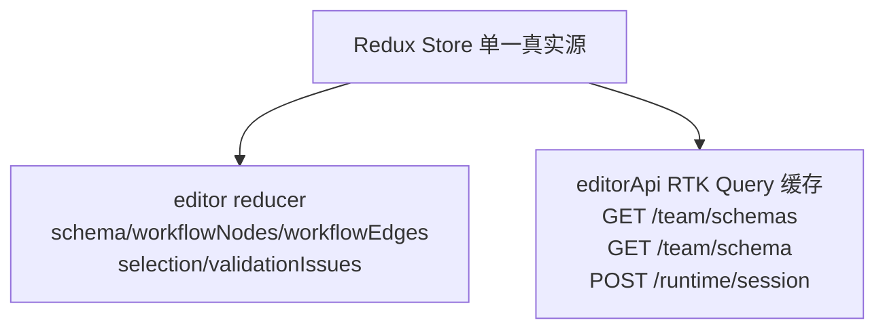

# 状态管理详解

本文档深入解释agents-team的状态管理架构，包括Redux store、选择器、reducers和中间件。

## 总体设计

项目采用两层状态管理：



## Redux Store结构

### Store配置

```typescript
// src/editor/state/editorStore.ts
import { configureStore } from '@reduxjs/toolkit';
import { editorApi } from '../api/editorApi';
import { editorReducer } from './editorReducer';

export const store = configureStore({
  reducer: {
    editor: editorReducer,           // 同步编辑状态
    editorApi: editorApi.reducer,    // 异步API缓存
  },
  middleware: (getDefaultMiddleware) =>
    getDefaultMiddleware()
      .concat(editorApi.middleware),  // RTK Query middleware
});

export type RootState = ReturnType<typeof store.getState>;
export type AppDispatch = typeof store.dispatch;
```

### EditorState 完整结构

```typescript
// src/editor/state/editorReducer.ts
interface EditorState {
  // 基本schema
  schema: TeamDefinition;
  schemaLoadStatus: 'idle' | 'loading' | 'success' | 'error';
  schemaLoadError?: string;
  schemaDocumentRevision: number;  // 本地变更计数
  
  // 验证
  validationIssues: SchemaIssue[];
  
  // 选择和UI
  selection?: Selection;
  edgeConnectionError?: string;
  
  // 图数据 (React Flow)
  workflowNodes: Node[];
  workflowEdges: Edge[];
  
  // Runtime状态
  runtimeSessions: Map<string, RuntimeSession>;
  activePipeline?: PipelineInstance;
  
  // UI状态
  sidebarOpen: boolean;
  editorMode: EditorMode;
}

interface Selection {
  type: 'agent' | 'department' | 'discussion' | 'pipeline' | 'node' | 'edge';
  id: string;
}
```

## Reducers

### 编辑操作 Reducers

```typescript
// src/editor/state/editorReducer.ts

// 1. Agent操作
addAgent: (state, action: PayloadAction<AgentDefinition>) => {
  state.schema.agents ??= [];
  state.schema.agents.push(action.payload);
  state.schemaDocumentRevision++;
};

updateAgent: (state, action: PayloadAction<AgentDefinition>) => {
  const idx = state.schema.agents.findIndex(a => a.id === action.payload.id);
  if (idx >= 0) {
    state.schema.agents[idx] = action.payload;
    state.schemaDocumentRevision++;
  }
};

removeAgent: (state, action: PayloadAction<string>) => {
  state.schema.agents = state.schema.agents.filter(a => a.id !== action.payload);
  state.schemaDocumentRevision++;
};

// 2. Department操作
addDepartment: (state, action: PayloadAction<DepartmentDefinition>) => {
  state.schema.departments ??= [];
  state.schema.departments.push(action.payload);
  state.schemaDocumentRevision++;
};

updateDepartment: (state, action: PayloadAction<DepartmentDefinition>) => {
  const idx = state.schema.departments.findIndex(d => d.id === action.payload.id);
  if (idx >= 0) {
    state.schema.departments[idx] = action.payload;
    state.schemaDocumentRevision++;
  }
};

// 3. Discussion操作
addDiscussion: (state, action: PayloadAction<DiscussionDefinition>) => {
  state.schema.discussions ??= [];
  state.schema.discussions.push(action.payload);
  state.schemaDocumentRevision++;
};

// ... 类似的Pipeline, Deliverable操作

// 4. 验证
updateValidationIssues: (state, action: PayloadAction<SchemaIssue[]>) => {
  state.validationIssues = action.payload;
};

clearValidationIssues: (state) => {
  state.validationIssues = [];
};

// 5. 工作流图
updateWorkflowNodes: (state, action: PayloadAction<Node[]>) => {
  state.workflowNodes = action.payload;
  state.schemaDocumentRevision++;
};

updateWorkflowEdges: (state, action: PayloadAction<Edge[]>) => {
  state.workflowEdges = action.payload;
  state.schemaDocumentRevision++;
};

// 6. Schema加载
schemaLoadStart: (state) => {
  state.schemaLoadStatus = 'loading';
};

schemaLoadSuccess: (state, action: PayloadAction<TeamDefinition>) => {
  state.schema = action.payload;
  state.schemaLoadStatus = 'success';
  state.schemaDocumentRevision = 0;  // 重置本地改动计数
  state.validationIssues = [];
};

schemaLoadError: (state, action: PayloadAction<string>) => {
  state.schemaLoadStatus = 'error';
  state.schemaLoadError = action.payload;
};

// 7. 选择
updateSelection: (state, action: PayloadAction<Selection | undefined>) => {
  state.selection = action.payload;
};

// 8. 修订号
incrementSchemaRevision: (state) => {
  state.schemaDocumentRevision++;
};

resetSchemaRevision: (state) => {
  state.schemaDocumentRevision = 0;
};
```

## Selectors (选择器)

### 创建基础选择器

```typescript
// src/editor/state/core/editorSelectors.ts

// 基础选择器
export const selectSchema = (state: RootState) => state.editor.schema;
export const selectSchemaLoadStatus = (state: RootState) => 
  state.editor.schemaLoadStatus;
export const selectValidationIssues = (state: RootState) =>
  state.editor.validationIssues;
export const selectSelection = (state: RootState) =>
  state.editor.selection;
export const selectWorkflowNodes = (state: RootState) =>
  state.editor.workflowNodes;
export const selectWorkflowEdges = (state: RootState) =>
  state.editor.workflowEdges;
export const selectSchemaDocumentRevision = (state: RootState) =>
  state.editor.schemaDocumentRevision;
```

### 派生选择器 (使用reselect)

```typescript
// src/editor/state/core/editorSelectors.ts
import { createSelector } from '@reduxjs/toolkit';

// 1. 当前选择的agent
export const selectSelectedAgent = createSelector(
  [selectSchema, selectSelection],
  (schema, selection) => {
    if (selection?.type !== 'agent') return undefined;
    return schema.agents?.find(a => a.id === selection.id);
  }
);

// 2. 当前选择的department
export const selectSelectedDepartment = createSelector(
  [selectSchema, selectSelection],
  (schema, selection) => {
    if (selection?.type !== 'department') return undefined;
    return schema.departments?.find(d => d.id === selection.id);
  }
);

// 3. 部门内的agents
export const selectDepartmentAgents = createSelector(
  [selectSchema, selectSelection],
  (schema, selection) => {
    if (selection?.type !== 'department') return [];
    const deptId = selection.id;
    return schema.agents?.filter(a => a.department_id === deptId) || [];
  }
);

// 4. 有效agents (带metadata.llm)
export const selectValidAgents = createSelector(
  [selectSchema],
  (schema) => schema.agents?.filter(a => a.metadata?.llm) || []
);

// 5. 是否有未保存的改动
export const selectHasUnsavedChanges = createSelector(
  [selectSchemaDocumentRevision],
  (revision) => revision > 0
);

// 6. 是否可以保存
export const selectCanSave = createSelector(
  [selectValidationIssues, selectHasUnsavedChanges],
  (issues, hasChanges) => hasChanges && issues.length === 0
);

// 7. 所有agents及其部门信息 (用于dropdown等)
export const selectAgentOptions = createSelector(
  [selectSchema],
  (schema) => schema.agents?.map(a => ({
    label: `${a.name} (${a.role || 'No role'})`,
    value: a.id
  })) || []
);

// 8. Workflow中已关联的agents (nodeId → agentId映射)
export const selectWorkflowAgentAssignments = createSelector(
  [selectWorkflowNodes],
  (nodes) => {
    const assignments = new Map<string, string>();  // nodeId → agentId
    nodes.forEach(node => {
      if (node.type === 'agent' && node.data?.agentId) {
        assignments.set(node.id, node.data.agentId);
      }
    });
    return assignments;
  }
);

// 9. Unassigned workflow nodes
export const selectUnassignedWorkflowNodes = createSelector(
  [selectWorkflowNodes],
  (nodes) => nodes.filter(n => n.type === 'agent' && !n.data?.agentId)
);

// 10. Validation issues by path
export const selectIssuesByPath = createSelector(
  [selectValidationIssues],
  (issues) => {
    const map = new Map<string, SchemaIssue[]>();
    issues.forEach(issue => {
      const path = issue.path.join('.');
      map.set(path, [...(map.get(path) || []), issue]);
    });
    return map;
  }
);
```

## RTK Query API缓存

### editorApi配置

```typescript
// src/editor/api/editorApi.ts
import { createApi, fetchBaseQuery } from '@reduxjs/toolkit/query/react';

export const editorApi = createApi({
  reducerPath: 'editorApi',
  baseQuery: fetchBaseQuery({
    baseUrl: process.env.VITE_SERVICE_ORIGIN || 'http://localhost:3000',
    prepareHeaders: (headers) => {
      // 添加认证token等
      return headers;
    }
  }),
  tagTypes: ['Schema', 'Schemas', 'RuntimeSession', 'AgentMarkdown'],
  endpoints: (builder) => ({
    // Schema查询
    getSchemas: builder.query<SchemaRecord[], void>({
      query: () => '/team/schemas',
      transformResponse: (res: ApiResponse<SchemaRecord[]>) => res.data,
      providesTags: ['Schemas']
    }),
    
    getSchema: builder.query<TeamDefinition, { key?: string }>({
      query: (arg) => `/team/schema${arg.key ? `?key=${arg.key}` : ''}`,
      transformResponse: (res: ApiResponse<TeamDefinition>) => res.data,
      providesTags: ['Schema']
    }),
    
    // Schema mutations
    saveSchema: builder.mutation<TeamDefinition, TeamDefinition>({
      query: (schema) => ({
        url: '/team/schema',
        method: 'PUT',
        body: schema
      }),
      transformResponse: (res: ApiResponse<TeamDefinition>) => res.data,
      invalidatesTags: ['Schema', 'Schemas'],
      async onQueryStarted(arg, { dispatch, queryFulfilled }) {
        // 乐观更新 (Optimistic Update)
        const patchResult = dispatch(
          editorApi.util.updateQueryData('getSchema', {}, (draft) => {
            Object.assign(draft, arg);
          })
        );
        
        try {
          await queryFulfilled;
        } catch {
          // Rollback on error
          patchResult.undo();
        }
      }
    }),
    
    validateSchema: builder.mutation<ValidationResult, TeamDefinition>({
      query: (schema) => ({
        url: '/team/validate',
        method: 'POST',
        body: schema
      }),
      transformResponse: (res: ApiResponse<ValidationResult>) => res.data
    }),
    
    // Runtime mutations
    createRuntimeSession: builder.mutation<
      RuntimeSession,
      { schema: TeamDefinition }
    >({
      query: (payload) => ({
        url: '/runtime/session',
        method: 'POST',
        body: payload
      }),
      transformResponse: (res: ApiResponse<RuntimeSession>) => res.data,
      providesTags: ['RuntimeSession']
    }),
    
    advanceRuntimeSession: builder.mutation<
      RuntimeSession,
      { sessionId: string }
    >({
      query: (payload) => ({
        url: `/runtime/session/${payload.sessionId}/advance`,
        method: 'POST'
      }),
      transformResponse: (res: ApiResponse<RuntimeSession>) => res.data,
      invalidatesTags: ['RuntimeSession']
    })
  })
});

export const {
  useGetSchemasQuery,
  useLazyGetSchemasQuery,
  useGetSchemaQuery,
  useLazyGetSchemaQuery,
  useSaveSchemaMutation,
  useValidateSchemaMutation,
  useCreateRuntimeSessionMutation,
  useAdvanceRuntimeSessionMutation
} = editorApi;
```

### 缓存策略

```typescript
// 1. Tag-based invalidation
invalidatesTags: ['Schema']  // 保存后清除Schema缓存

// 2. 手动缓存管理
dispatch(editorApi.util.invalidateTags(['Schema']));

// 3. 乐观更新 (Optimistic Update)
const patchResult = dispatch(
  editorApi.util.updateQueryData('getSchema', {}, draft => {
    draft.name = newName;
  })
);

// 4. 缓存过期时间
keepUnusedDataFor: 5 * 60,  // 5分钟后清除未使用的缓存
```

## Middleware中间件

### Redux中间件整合

```typescript
// src/editor/state/editorStore.ts
const store = configureStore({
  reducer: { editor: editorReducer, editorApi: editorApi.reducer },
  middleware: (getDefaultMiddleware) =>
    getDefaultMiddleware({
      serializableCheck: {
        // 允许特定的non-serializable值
        ignoredActions: ['editorApi/executeQuery/fulfilled'],
        ignoredPaths: ['editorApi']
      }
    })
      .concat(editorApi.middleware)
      .concat(customMiddleware)
});

// 自定义middleware - 日志记录
const customMiddleware = (store) => (next) => (action) => {
  console.log('Dispatching:', action.type);
  const result = next(action);
  console.log('Next state:', store.getState());
  return result;
};

// 自定义middleware - 自动保存
const autoSaveMiddleware = (store) => (next) => (action) => {
  const result = next(action);
  
  // 如果有改动且没在保存中
  const state = store.getState();
  if (state.editor.schemaDocumentRevision > 0 && 
      state.editor.schemaLoadStatus !== 'loading') {
    // 防抖, 3秒后自动保存
    debounce(() => {
      store.dispatch(saveSchema(state.editor.schema));
    }, 3000)();
  }
  
  return result;
};
```

## 状态更新模式

### 1. 同步更新 (本地编辑)

```typescript
const editor = useTeamEditor();

// 触发action
editor.updateAgent({ id: 'a1', name: 'Alice' });

// 流程:
// 1. dispatch(updateAgent({ id: 'a1', name: 'Alice' }))
// 2. reducer更新state.editor.schema.agents[0]
// 3. selector重新计算 (reselect记忆化)
// 4. connected components重新render
// 5. 用户看到UI更新
```

### 2. 异步更新 (服务器同步)

```typescript
const [saveSchema] = editorApi.useSaveSchemaMutation();

await saveSchema(newSchema)
  .unwrap()
  .then(result => {
    // 成功回调
    dispatch(resetSchemaRevision());  // 清除本地改动标记
  })
  .catch(error => {
    // 错误回调
    dispatch(updateValidationIssues(error.error.issues));
  });

// 流程:
// 1. mutation发送HTTP请求
// 2. 服务端验证并保存
// 3. 响应返回
// 4. RTK Query自动invalidate缓存
// 5. 前端selector重新查询
// 6. Redux state更新
// 7. Components重新render
```

### 3. 乐观更新

```typescript
// 假定成功, 立即更新UI
const patchResult = dispatch(
  editorApi.util.updateQueryData('getSchema', {}, draft => {
    draft.name = newName;
  })
);

// 发送请求
saveSchema(newSchema)
  .unwrap()
  .catch(() => {
    // 失败时回滚
    patchResult.undo();
  });
```

## 常见模式

### 1. Form绑定

```typescript
export const AgentForm = () => {
  const dispatch = useAppDispatch();
  const agent = useAppSelector(selectSelectedAgent);
  const methods = useForm<AgentDefinition>({ defaultValues: agent });
  
  const onSubmit = (data: AgentDefinition) => {
    dispatch(updateAgent(data));
  };
  
  return (
    <form onSubmit={methods.handleSubmit(onSubmit)}>
      <input {...methods.register('name')} />
      <button type="submit">Save</button>
    </form>
  );
};
```

### 2. 条件渲染基于状态

```typescript
const EditorHero = () => {
  const hasChanges = useAppSelector(selectHasUnsavedChanges);
  const issues = useAppSelector(selectValidationIssues);
  
  return (
    <>
      {hasChanges && <Badge>Unsaved</Badge>}
      {issues.length > 0 && (
        <Alert severity="error">
          {issues.length} validation errors
        </Alert>
      )}
    </>
  );
};
```

### 3. 派生数据计算

```typescript
const AgentOptionsList = () => {
  // 选择器会记忆化结果, 避免不必要的重新计算
  const options = useAppSelector(selectAgentOptions);
  
  return (
    <select>
      {options.map(opt => (
        <option key={opt.value} value={opt.value}>
          {opt.label}
        </option>
      ))}
    </select>
  );
};
```

## 性能优化

### 1. 选择器记忆化

```typescript
// ❌ 不好: 每次render都重新计算
const agents = useAppSelector(state =>
  state.editor.schema.agents.filter(a => a.role === 'Engineer')
);

// ✓ 好: 使用reselect记忆化
const selectEngineers = createSelector(
  [selectSchema],
  schema => schema.agents?.filter(a => a.role === 'Engineer') || []
);

const engineers = useAppSelector(selectEngineers);
```

### 2. 分割大state

```typescript
// ❌ 不好: 订阅整个editor state
const state = useAppSelector(state => state.editor);

// ✓ 好: 只订阅需要的部分
const schema = useAppSelector(selectSchema);
const issues = useAppSelector(selectValidationIssues);
```

### 3. 事件委托vs绑定

```typescript
// ❌ 不好: 每个项目创建新回调
{agents.map(agent => (
  <AgentItem
    key={agent.id}
    agent={agent}
    onUpdate={() => dispatch(updateAgent(agent))}
  />
))}

// ✓ 好: 使用事件委托或高阶组件
const handleAgentUpdate = (id: string, data: Partial<Agent>) => {
  dispatch(updateAgent({ ...agents.find(a => a.id === id), ...data }));
};

{agents.map(agent => (
  <AgentItem
    key={agent.id}
    agent={agent}
    onUpdate={handleAgentUpdate}
  />
))}
```

## 测试Redux

### 单元测试

```typescript
import { configureStore } from '@reduxjs/toolkit';
import { editorReducer } from './editorReducer';

test('updateAgent updates the agent in state', () => {
  const store = configureStore({ reducer: { editor: editorReducer } });
  const agent = { id: 'a1', name: 'Alice' };
  
  store.dispatch(updateAgent({ ...agent, name: 'Bob' }));
  
  const state = store.getState();
  expect(state.editor.schema.agents[0].name).toBe('Bob');
});
```

### Selector测试

```typescript
test('selectSelectedAgent returns the selected agent', () => {
  const state = {
    editor: {
      schema: { agents: [{ id: 'a1', name: 'Alice' }] },
      selection: { type: 'agent', id: 'a1' }
    }
  };
  
  const agent = selectSelectedAgent(state);
  expect(agent?.name).toBe('Alice');
});
```

## 下一步阅读

- [数据流与集成](./03-data-flow-and-integration.md)
- [Runtime 引擎](./04-runtime-engine.md)
- [核心函数参考](./07-core-functions-reference.md)
