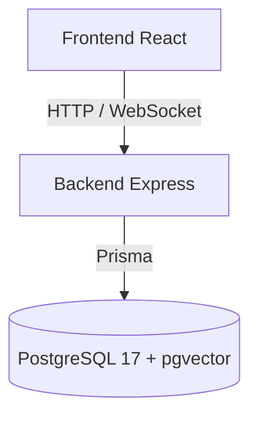
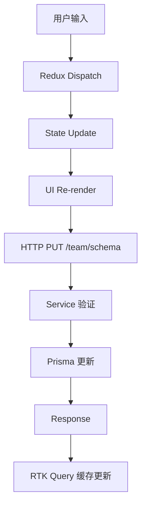
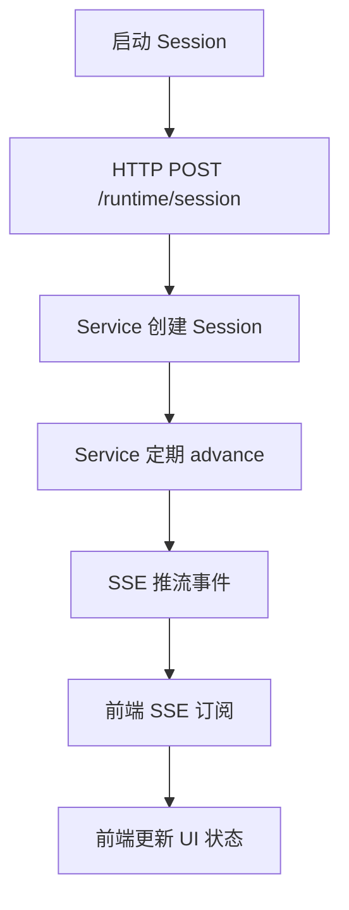
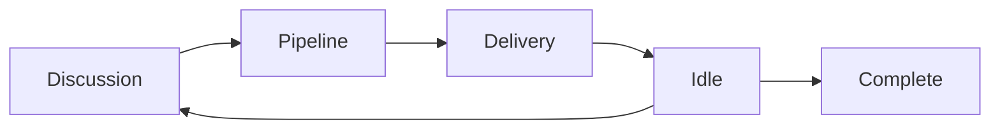

# 架构文档索引

欢迎查阅 agents-team 项目的完整架构文档。本索引帮助你快速找到所需的内容。

## 📚 文档列表

### [00 - 架构概览](./00-architecture-overview.md)
**入门必读** | 适合: 所有人

快速了解项目的整体架构：
- 系统组成 (Frontend + Backend)
- 核心概念 (Team Schema, Runtime Session, Work Mode)
- 系统分层
- 数据流总览
- 部署拓扑

**关键概念**: Team Schema · Runtime Session · Work Mode · Workflow Graph

---

### [01 - Service 后端架构](./01-service-architecture.md)
**后端开发** | 适合: 后端开发者、想理解服务设计的人

深入了解Express后端的设计：
- 启动流程
- 路由系统 (自动注册)
- 模块分层 (Domain, Schema, Routes, Runtime, Agent, Adapter)
- Schema验证 (Zod + 引用验证)
- Runtime引擎核心
- 数据库模式 (Prisma)
- 错误处理
- 性能考虑

**关键模块**: `src/domain/` · `src/schema/` · `src/routes/` · `src/runtime/` · `src/agent/` · `src/adapter/`

---

### [02 - 前端编辑器架构](./02-team-schema-editor-architecture.md)
**前端开发** | 适合: 前端开发者、想理解UI设计的人

理解React编辑器的架构：
- 应用结构与路由
- Redux状态管理
- 核心Hooks (useTeamEditor, useTeamSchemaService, useRuntimeSession等)
- API客户端 (RTK Query)
- 页面组件
- React Flow自定义组件 (节点、边)
- 表单与选择面板
- 通知系统
- 性能优化

**关键Hooks**: `useTeamEditor` · `useTeamSchemaService` · `useRuntimeSession` · `useWorkflowGraphEditor`

---

### [03 - 数据流与集成](./03-data-flow-and-integration.md)
**系统设计** | 适合: 需要理解端到端流程的人

完整的数据流讲解：
- 编辑流程 (用户输入 → 本地改动 → 网络保存)
- Runtime执行流程 (Session创建 → 状态推进 → SSE推流)
- 关键集成点 (Frontend ↔ Backend, Redux ↔ RTK Query, React Flow ↔ Redux)
- 错误处理链
- 并发与竞态条件处理
- 性能监控点

**场景**: 理解一次完整的编辑-保存-执行过程

---

### [04 - Runtime 引擎](./04-runtime-engine.md)
**Runtime系统** | 适合: 需要理解执行流程的人

Runtime引擎的核心设计：
- 核心数据模型 (RuntimeSession, RuntimeState, Ticket等)
- 状态机设计 (Work Mode路由)
- 执行引擎 (advanceRuntimeSession)
- Discussion/Pipeline/Delivery stage执行
- Session创建与初始化
- 观测性 (事件流、审计日志)
- 测试策略

**关键函数**: `advanceRuntimeSession` · `routeWorkMode` · `createRuntimeSession`

---

### [05 - API 合同](./05-api-contracts.md)
**API文档** | 适合: 需要调用API的人、前后端协作

HTTP API的完整规范：
- 响应格式标准化
- HTTP状态码约定
- Team Schema API (CRUD)
- Runtime Session API (创建、推进、流式)
- Agent Markdown API (CRUD)
- Agent Gateway API
- 错误码参考
- 网络考虑

**使用场景**: 集成第三方客户端、调试API

---

### [06 - 状态管理](./06-state-management.md)
**Redux深度** | 适合: 前端开发者

Redux与RTK Query的细节：
- Redux store结构
- Reducers与actions
- Selectors (基础与派生)
- RTK Query缓存策略
- 中间件
- 常见模式
- 性能优化
- 测试方法

**关键概念**: Selectors记忆化 · Tag-based invalidation · 乐观更新

---

### [07 - 核心函数参考](./07-core-functions-reference.md)
**函数文档** | 适合: 需要快速查阅的开发者

按功能分类的所有关键函数：
- Schema加载与验证 (loadTeamSchema, validateTeamReferences)
- Runtime执行 (advanceRuntimeSession, createRuntimeSession等)
- 编辑器操作 (withWorkflowLayoutDocument)
- 工作流图操作 (createWorkflowEdge, initializeWorkflowGraph)
- Hooks (useTeamEditor, useRuntimeSession等)
- 辅助函数

**用途**: 作为quick reference使用

---

## 🗺️ 阅读路线

### 🔰 新手入门 (1小时)
1. [00 - 架构概览](./00-architecture-overview.md)
2. [02 - 前端编辑器架构](./02-team-schema-editor-architecture.md) (快速浏览)
3. [01 - Service 后端架构](./01-service-architecture.md) (快速浏览)

### 👨‍💼 项目经理 (30分钟)
1. [00 - 架构概览](./00-architecture-overview.md)
2. [04 - Runtime 引擎](./04-runtime-engine.md) (理解执行流程)

### 🔧 前端开发者 (2小时)
1. [00 - 架构概览](./00-architecture-overview.md)
2. [02 - 前端编辑器架构](./02-team-schema-editor-architecture.md) (详细阅读)
3. [06 - 状态管理](./06-state-management.md)
4. [03 - 数据流与集成](./03-data-flow-and-integration.md)
5. [07 - 核心函数参考](./07-core-functions-reference.md) (bookmark)

### 🔧 后端开发者 (2小时)
1. [00 - 架构概览](./00-architecture-overview.md)
2. [01 - Service 后端架构](./01-service-architecture.md) (详细阅读)
3. [04 - Runtime 引擎](./04-runtime-engine.md)
4. [05 - API 合同](./05-api-contracts.md)
5. [07 - 核心函数参考](./07-core-functions-reference.md) (bookmark)

### 🎨 全栈开发者 (4小时)
1. [00 - 架构概览](./00-architecture-overview.md)
2. [02 - 前端编辑器架构](./02-team-schema-editor-architecture.md)
3. [01 - Service 后端架构](./01-service-architecture.md)
4. [03 - 数据流与集成](./03-data-flow-and-integration.md)
5. [04 - Runtime 引擎](./04-runtime-engine.md)
6. [06 - 状态管理](./06-state-management.md)
7. [05 - API 合同](./05-api-contracts.md)
8. [07 - 核心函数参考](./07-core-functions-reference.md) (bookmark)

---

## 🔍 按场景查阅

### 我想...

**...理解项目做什么** → 读 [00 - 架构概览](./00-architecture-overview.md)

**...修改前端UI** → 阅读 [02 - 前端编辑器架构](./02-team-schema-editor-architecture.md) + [06 - 状态管理](./06-state-management.md)

**...修改后端API** → 阅读 [01 - Service 后端架构](./01-service-architecture.md) + [05 - API 合同](./05-api-contracts.md)

**...修改执行逻辑** → 阅读 [04 - Runtime 引擎](./04-runtime-engine.md)

**...调用某个函数** → 查看 [07 - 核心函数参考](./07-core-functions-reference.md)

**...追踪一个bug** → 阅读 [03 - 数据流与集成](./03-data-flow-and-integration.md)

**...新增API端点** → 查看 [01 - Service 后端架构](./01-service-architecture.md) 的"路由系统"章节

**...理解Schema验证** → 阅读 [01 - Service 后端架构](./01-service-architecture.md) 的"Schema"部分

**...理解Runtime执行** → 详读 [04 - Runtime 引擎](./04-runtime-engine.md)

---

## 🔗 核心链接

### 前端
- **入口**: `packages/team-schema-editor/src/app/App.tsx`
- **编辑器Hook**: `packages/team-schema-editor/src/editor/hooks/useTeamEditor.ts`
- **API客户端**: `packages/team-schema-editor/src/editor/api/editorApi.ts`
- **Redux Store**: `packages/team-schema-editor/src/editor/state/editorStore.ts`

### 后端
- **入口**: `packages/service/src/index.ts`
- **路由**: `packages/service/src/routes/`
- **Runtime**: `packages/service/src/runtime/`
- **Schema**: `packages/service/src/schema/`

### 类型定义
- **Domain**: `packages/service/src/domain/`
- **Frontend Types**: `packages/team-schema-editor/src/editor/model/`

---

## 📊 架构图速查

### 系统架构


### 数据流 (编辑)


### 数据流 (Runtime)


### 工作模式流


---

## 📝 常用命令

```bash
# 开发服务
PORT=3000 pnpm --filter @agents-team/service dev
VITE_SERVICE_ORIGIN=http://localhost:3000 pnpm --filter @agents-team/team-schema-editor dev

# 构建
pnpm --filter @agents-team/service build
pnpm --filter @agents-team/team-schema-editor build

# 数据库
pnpm --filter @agents-team/service prisma migrate dev
pnpm --filter @agents-team/service prisma studio

# 测试
pnpm --filter @agents-team/team-schema-editor test:e2e
pnpm --filter @agents-team/service test

# 类型检查
pnpm typecheck
```

---

## ❓ FAQ

**Q: 架构文档不完整?**
A: 这些文档是v0.1版本。欢迎通过PR补充或修正。

**Q: 我应该从哪里开始?**
A: 如果是新加入项目，从"架构概览"开始，然后按你的角色选择相应的路线。

**Q: 有最佳实践指南吗?**
A: 参考根目录下的 `.instructions.md` 文件 (如果存在)，以及各个包的README。

**Q: 代码和文档不一致怎么办?**
A: 代码优先。文档可能滞后。请提交Issue或PR更新文档。

---

## 🚀 贡献指南

文档改进方式：

1. 发现问题 → 提Issue或PR
2. 代码变更 → 更新相应文档章节
3. 新功能 → 补充相关文档

文档风格：
- 使用markdown格式
- 包含代码示例
- 说明关键决策理由
- 提供快速参考表

---

**上次更新**: 2026-06-27
**文档版本**: v0.1
**项目版本**: v0.0.0 (MVP)

---

## 相关资源

- [项目README](../../README.md)
- [PRD文档](../PRDs/PRD.md)
- [实现计划](../implementation/)
- [需求文档](../requirements/)
- [API示例](../examples/)
