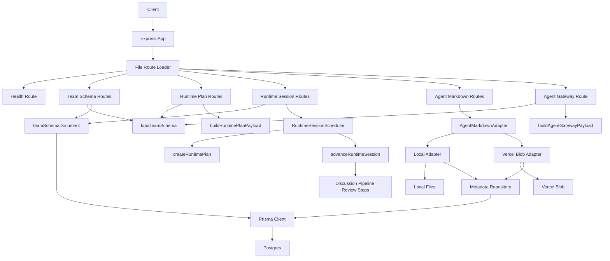
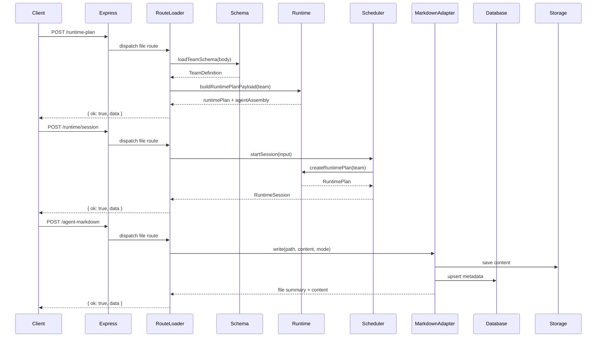

# Service Architecture Overview

本文档总结当前 `packages/service` 的实际实现架构，重点说明模块边界、主请求链路以及当前已落地的存储和运行时能力。它描述的是已经存在的代码，而不是目标蓝图。

## 整体架构图



## 主请求链路



## 分层说明

当前服务可以分成五层。

### 1. 入口与路由层

入口在 `src/index.ts`。服务启动后会：

- 初始化 Express
- 注入 `agentMarkdownAdapter` 和 `runtimeSessionScheduler`
- 加载 `src/routes/` 下的文件系统路由
- 统一挂载 404 和 500 错误处理

路由注册由 `src/routes/loader.ts` 负责，映射规则是：

- `src/routes/<path>/<method>.ts` 映射到 `<METHOD> /<path>`
- 目录名 `[id]` 映射为路径参数 `:id`
- `_shared` 和隐藏目录不会注册成路由

当前服务对外暴露的主要能力是：

- Team Schema 校验与持久化
- Runtime plan 生成
- Agent gateway payload 生成
- Runtime session 生命周期控制与推进
- Agent Markdown 的增删改查与校验

### 2. Schema 与持久化文档层

`src/schema/` 负责把外部输入从 `unknown` 解析成领域对象，并处理当前唯一持久化 team schema 文档。

- `teamDefinitionSchema.ts` 使用 Zod 定义 Team Schema 结构
- `loadTeamSchema.ts` 负责结构校验和跨对象引用校验
- `teamSchemaDocument.ts` 负责把当前 team schema 文档持久化到 Prisma/Postgres

这里有一个实现细节需要注意：

- 路由层当前暴露的是 `/team/schemas/:id`
- 但持久化层现在只管理固定 key `current`
- 因此当前实现仍然是“单文档 schema 存储”

### 3. 领域模型层

`src/domain/` 是系统内部的数据语言，主要定义：

- Team、Department、Agent、Policy 等组织对象
- RuntimePlan、RuntimeSession、RuntimeState、AuditEvent 等运行时对象
- Capability、Discussion、Delivery、Memory、Review 等跨模块语义结构

这一层基本不做 I/O，不依赖 Express、文件系统、Blob 或数据库。

### 4. 运行时编排与装配层

这一层主要由 `src/runtime/` 和 `src/agent/assembly/` 组成。

- `createRuntimePlan.ts` 负责从 TeamDefinition 生成 RuntimePlan
- `buildRuntimePlanPayload.ts` 负责把 RuntimePlan 和 AgentAssemblyBundle 序列化为 API 返回结构
- `buildAgentGatewayPayload.ts` 负责输出面向上游网关消费的 agent 绑定结果
- `runtimeSessionScheduler.ts` 负责 session 的启动、查询、暂停、恢复、推进和终止
- `advanceRuntimeSession.ts` 负责最小 MVP 调度推进，覆盖 discussion、ticket admission、pipeline、review 等步骤
- `createExecutionContext.ts` 负责初始化 session 的执行态和审计轨迹

这一层已经不只是静态 plan 生成，还包含最小可运行的 session scheduler 和执行推进逻辑。

### 5. Agent Markdown 与基础设施适配层

`src/agent/markdown/` 与 `src/adapter/` 共同构成内容管理子系统。

`src/agent/markdown/` 负责：

- 路径规范化
- front matter 校验
- 文件摘要生成
- 本地文件读写基础能力

`src/adapter/` 负责：

- `AgentMarkdownAdapter` 抽象统一端口
- `localAgentMarkdownAdapter.ts` 接本地文件系统
- `vercelBlobAgentMarkdownAdapter.ts` 接 Vercel Blob
- `agentMarkdownMetadataRepository.ts` 管理 Markdown 元数据
- `prismaClient.ts` 建立 Postgres 连接

## Runtime Session 子系统

Runtime session 是当前 service 已经落地的一条重要链路。

### 已实现能力

- `POST /runtime/session` 启动 session
- `GET /runtime/session/:id` 读取快照
- `POST /runtime/session/:id/pause` 暂停
- `POST /runtime/session/:id/resume` 恢复
- `POST /runtime/session/:id/advance` 推进一步执行
- `POST /runtime/session/:id/terminate` 终止

### 当前状态模型

当前 session 会持久保存在进程内 `Map` 中，状态包含：

- lifecycle status：`running`、`paused`、`terminated`
- `runtimePlan`
- `state.context`
- `pendingTickets`
- `completedTickets`
- `completedStepResults`
- `reviewResults`
- `generatedHandoffs`
- `auditTrail`

这意味着它已经能支持最小 MVP 的执行态观察，但还不是跨进程持久化 scheduler。

## Agent Markdown 子系统

Agent Markdown 子系统是当前最完整的内容管理链路。

### 子模块职责

- `src/routes/agent-markdown/**` 处理 HTTP 入口
- `src/routes/_shared/agentMarkdown.ts` 处理请求解析和 adapter 解析
- `src/agent/markdown/` 负责校验、摘要和本地文件能力
- `src/adapter/` 负责可切换的内容存储实现和 metadata 持久化

### 存储设计

当前采用“内容存储”和“元数据存储”分离设计。

- 内容存储：本地文件系统或 Vercel Blob
- 元数据存储：统一进入 Postgres

这样做的结果是：

- 上层 API 不需要感知底层内容存储差异
- metadata 可以统一查询、同步和扩展
- 即使内容在 Blob 中，系统仍然有统一索引入口

## 响应模型

当前服务已经统一到 `src/routes/_shared/response.ts`：

- 成功：`{ ok: true, data }`
- 失败：`{ ok: false, error: { code, message, issues? } }`

错误状态码由 issue code 推导，主要规则包括：

- `file_missing` -> `404 not_found`
- `file_conflict` -> `409 conflict`
- 其余校验错误 -> `400 validation_failed`

## 关键设计取舍

- Team Schema 是 runtime plan、agent gateway 和 runtime session 的统一输入源
- 路由层保持薄，业务逻辑下沉到 `schema/`、`runtime/`、`agent/assembly/`、`agent/markdown/` 和 `adapter/`
- 文件路由替代手写集中路由表，降低新增接口时的样板代码
- Team Schema 持久化当前仍是单文档模式，但通过 `/team/schemas/:id` 暴露了未来扩展到多文档的 URL 形态
- Runtime session 当前为进程内 scheduler，适合 MVP 和本地联调，不适合多实例共享
- Agent Markdown 内容与 metadata 分离，便于切换本地文件和 Blob 存储

## 当前代码目录映射

```text
src/
  index.ts                  # Express 入口与依赖注入
  routes/                   # 文件系统路由与共享 HTTP 工具
  domain/                   # 领域类型与常量
  schema/                   # Team Schema 解析与持久化文档
  runtime/                  # RuntimePlan、RuntimeSession 与执行推进
  agent/
    assembly/               # Agent 装配与 capability/memory 解析
    gateway/                # Agent gateway 绑定解析
    markdown/               # Markdown 校验、摘要、路径和本地文件能力
  adapter/                  # 存储适配器、Prisma repository 与客户端
```

## 总结

当前 `packages/service` 已经从“静态 Team Schema 装配服务”扩展为一个具备统一 HTTP envelope、文件路由、Schema 持久化、Agent Markdown 管理、Agent Gateway 输出和最小 runtime session 调度能力的 service。最成熟的链路是 Team Schema -> RuntimePlan/AgentAssembly 输出，以及 Agent Markdown 的内容管理链路；runtime session 则已经具备 MVP 级别的生命周期控制和状态推进能力。