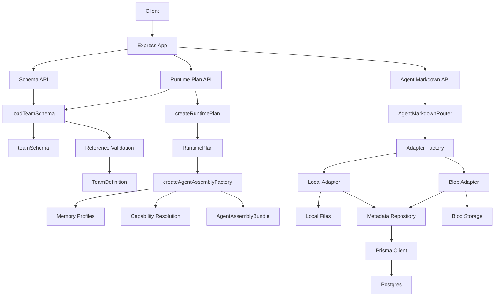
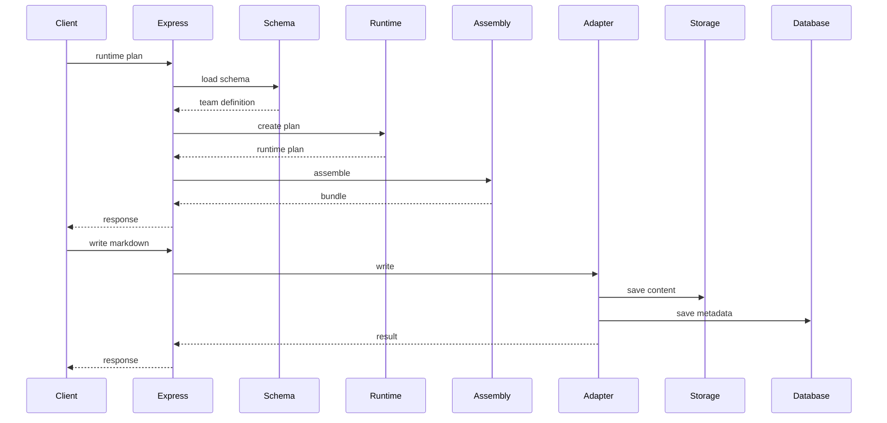

# Service Architecture Overview

本文档总结当前 `packages/service` 的实现架构，重点说明模块边界、主请求链路以及当前存储设计。它描述的是已经落地的服务骨架，而不是抽象目标结构。

## 整体架构图



## 主请求链路



## 分层说明

当前服务可以分成五层。

### 1. 接口层

入口在 `src/index.ts`。这一层只负责挂载 Express、解析请求、调用底层函数并把结果序列化为 HTTP 响应。当前主要暴露三类能力：

- Team Schema 读取与校验。
- Runtime Plan 生成与 Agent Assembly 输出。
- Agent Markdown 的增删改查与校验。

这一层保持较薄，没有把业务规则直接写进路由处理函数。

### 2. Schema 解析层

`src/schema/` 负责把外部输入从 `unknown` 解析为领域对象。

- `teamDefinitionSchema.ts` 使用 Zod 定义字段结构，并把输入从 `snake_case` 转为内部 `camelCase` 结构。
- `loadTeamSchema.ts` 负责 JSON 解析、Zod 校验以及跨对象引用校验。

输出结果统一是 `ValidationResult<TeamDefinition>`，这样 API 层可以直接消费成功值或错误列表。

### 3. 领域模型层

`src/domain/` 是当前服务的语义底座，主要包含：

- 团队、部门、Agent、讨论策略、记忆策略、审查策略等对象定义。
- 运行时状态、错误、审计事件等运行期结构。
- 能力、交付、讨论、记忆等跨模块共享类型。

这一层基本不做 I/O，也不关心 Express、数据库、文件系统或 Blob，职责是定义系统内部稳定的数据语言。

### 4. 运行时装配层

这一层主要由 `src/runtime/` 和 `src/agent/assembly/` 组成。

- `createRuntimePlan.ts` 把 TeamDefinition 拷贝为不可变运行时快照，并建立 `departmentsById`、`agentsById` 等索引。
- `createAgentAssemblyFactory.ts` 在 RuntimePlan 之上装配单个 Agent，补齐 memory profile 和 capability 解析结果。
- `resolveAgentCapabilities.ts` 与 `resolveMemoryProfilesById.ts` 负责局部解析逻辑。

这里的核心思想是把“原始定义”和“执行态结构”分开。`RuntimePlan` 面向团队级快照，`AgentAssembly` 面向单 Agent 执行装配结果。

### 5. 基础设施适配层

`src/adapter/` 负责把外部存储接进系统，并对上暴露稳定接口。

- `AgentMarkdownAdapter` 是统一端口。
- `localAgentMarkdownAdapter.ts` 负责本地文件模式。
- `vercelBlobAgentMarkdownAdapter.ts` 负责 Blob 模式。
- `agentMarkdownMetadataRepository.ts` 负责元数据的 Prisma 持久化。
- `prismaClient.ts` 负责建立 Postgres 连接。

这一层的重点不是业务规则，而是把文件系统、Blob、数据库的差异隐藏在统一接口之后。

## Agent Markdown 子系统

Agent Markdown 子系统是当前实现里最完整的一条“端到端”链路。

### 子模块职责

- `src/agent/markdown/` 负责路径规范化、front matter 校验、摘要提取、本地文件读写、统一错误结果封装。
- `src/adapter/` 负责把这些本地能力包装成可替换的存储适配器。
- Prisma metadata repository 负责把 Markdown 的结构化摘要写入数据库。

### 存储设计

当前采用“内容存储”和“元数据存储”分离设计。

- 内容存储：本地文件系统或 Vercel Blob。
- 元数据存储：统一进入 Postgres 的 `agent_markdowns` 表。

这样做的好处是：

- 内容后端可切换，不影响上层路由接口。
- 元数据可以被统一检索、同步和扩展。
- 即使内容在 Blob 中，系统仍然可以依赖数据库维护索引和查询入口。

## 关键设计取舍

- Team Schema 是运行时装配的唯一输入源，运行时不直接消费未经校验的原始 JSON。
- `RuntimePlan` 与 `AgentAssembly` 是两个明确的中间层对象，分别面向团队级和 Agent 级运行态。
- 路由层保持薄，核心逻辑下沉到 `schema/`、`runtime/`、`agent/assembly/`、`agent/markdown/` 和 `adapter/`。
- 基础设施依赖通过适配器隔离，当前已经把本地文件、Vercel Blob 和 Prisma/Postgres 分离开。
- 领域层保持纯 TypeScript 类型和规则定义，便于后续继续扩展测试和执行逻辑。

## 当前代码目录映射

```text
src/
  index.ts                  # Express 入口与路由挂载
  domain/                   # 领域类型与常量
  schema/                   # Team Schema 解析与引用校验
  runtime/                  # RuntimePlan 创建
  agent/
    assembly/               # Agent 装配与 capability/memory 解析
    markdown/               # Markdown 校验、摘要、路径和本地文件能力
  adapter/                  # 存储适配器与 Prisma Repository
```

## 总结

当前 `packages/service` 已经具备一个清晰的分层骨架：上层是 Express API，中间是 schema 解析与 runtime 装配，下层是面向存储差异的适配器。它最成熟的部分是 Team Schema 装配链路和 Agent Markdown 管理链路。后续如果继续扩展执行流、审查流和记忆流，现有边界基本可以直接承接，不需要先推翻目录结构。